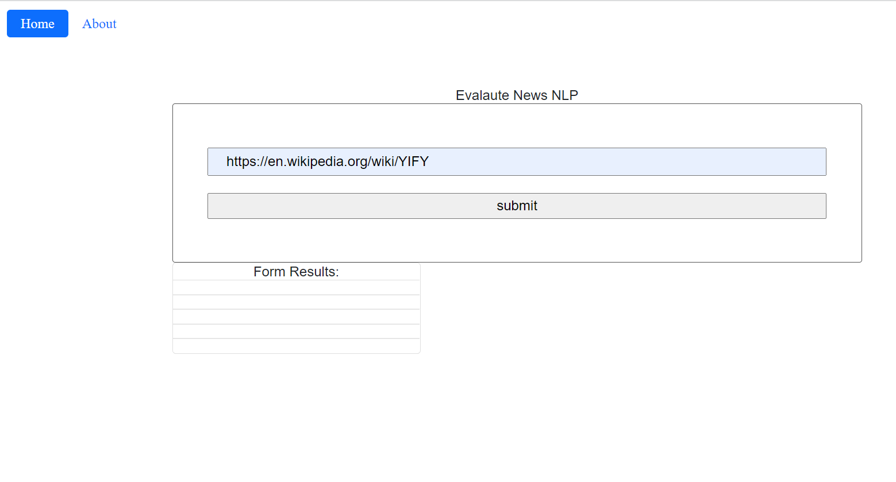

# Evaluate New Article With NLP: A WebPack Project
Evaluate New Article With NLP created Using WebPack to manage the application as a part of the [FWD-Advanced Track-Udacity's React Nanodegree program](https://egfwd.com/).

## About
It aims to build a web tool that allows users to run Natural Language Processing (NLP) on articles or blogs found on other websites. When a user submits a URL of an article, the web page then dispalys sentiment analysis returned from [meaningcloud API](https://www.meaningcloud.com/products/sentiment-analysis), based on the contents of the article.

### Udacity Starter Code
[https://github.com/udacity/fend/tree/refresh-2019/projects/evaluate-news-nlp](https://github.com/udacity/fend/tree/refresh-2019/projects/evaluate-news-nlp)

## Backend
Web page dispalys sentiment analysis returned from [meaningcloud API](https://www.meaningcloud.com/products/sentiment-analysis), based on the contents of the article.

## Development - Build Tools:
* HTML
* CSS
* JavaScript
* Node
* Express
* Webpack
* meaningcloud API
* Jest
* Workbox

## To Start Project(installation)
1. Install npm
2. Start the project
`npm run build-prod` 
`npm start`

3. Open browser at http://localhost:8081/

## References:
- Mainly All Lessons from ClassRoom
- Connect Session Leader help and explaining
- Walking through Build Tools & Single Page Web Apps lessons
- Main guids for Mohamed Zanaty Udacity support
	-[https://www.youtube.com/watch?v=xPuBEwwL-lA]

## Screenshots
